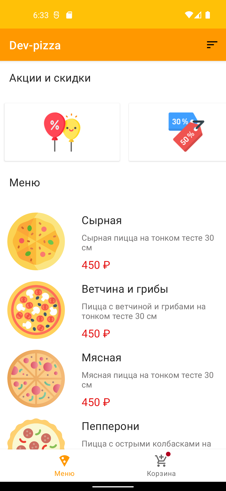
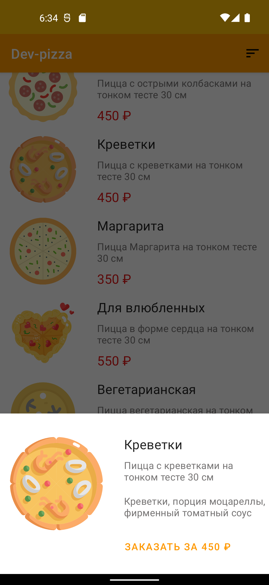

Демонстрационный проект для заказа пиццы
===================================

Что реализовано
--------------

- Navigation component
- DI with Hilt
- Взаимодействие с api с помощью Retrofit2
- Moshi для конвертации объектов
- RecyclerView
- Coil для загрузки и отображения изображений
- Paging3 для порционной загрузки данных

Скриншоты
--------------
  

Функции и способы их реализации
--------------

Все данные приложение **получает от API** с помощью `Retrofit2` (для конвертации объектов используется `Moshi`). Для
данного приложения специально разработан
проект [demo-api - Spring Boot REST API для мобильного приложения](https://github.com/podule/demo-api), который
запускается на локальном хосте и передает необходимые данные. Все данные выдуманы, изображения взяты
из [flaticon.com](https://www.flaticon.com/).

**Главный экран состоит из списка акции и меню.**
Отображение списков реализовано с помощью библиотеки `RecyclerView`, которое динамически отображает списки разного
формата - горизонтальный список для отображения скидок и акций, вертикальный список для отображения меню. **Меню
подгружается постранично** с помощью библиотеки `Paging3`.

В меню Toolbar есть кнопка **фильтрации меню по цене**.

При нажатии на элемент списка меню отображается `BottomSheetDialogFragment` **с детальными данными пиццы и возможностью
заказа пиццы**. При заказе пиццы создается модель заказа и пицца попадает в корзину. Данные идентификатора корзины
хранятся в `Proto DataStore`.

В корзину можно перейти через меню `BottomNavigationView`, если в корзине есть данные показывается badge элемента меню
корзины.

Интерфейс корзины находится в разработке.

Архитектура
--------------
Приложение следует подходу `Single Activity`. Все интерфейсы реализованы с помощью фрагментов, навигация между
компонентами осуществляется с помощью `Navigation component`.

Внедрение зависимостей реализуется с помощью `Hilt`.

Приложение использует архитектуру `Model-View-ViewModel` (`MVVM`). `View` и `ViewModel` взаимодействуют с помощью `Flow`
. Для отображения данных используется `Data Binding Library`, которая позволяет привязывать компоненты пользовательского
интерфейса в макетах к источникам данных, используя декларативный формат.

Тестирование
--------------
Реализованы локальный тесты репозитория, пагинатора, viewModel фрагмента.

Реализованы инструментальные тесты для MenuFragment.
